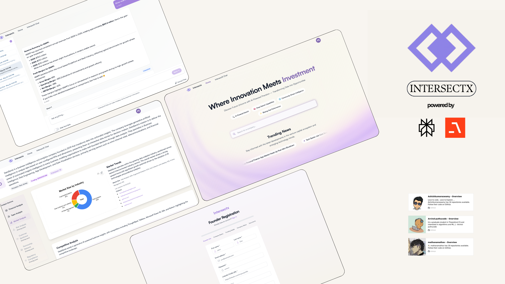

<a name="readme-top"></a>

<!-- PROJECT SHIELDS -->
[![Contributors][contributors-shield]][contributors-url]
[![Forks][forks-shield]][forks-url]
[![Stargazers][stars-shield]][stars-url]
[![Issues][issues-shield]][issues-url]
[![MIT License][license-shield]][license-url]

<br />
<div align="center">
  <a href="https://github.com/Ashishkumaraswamy/VentureInsights-Backend">
    
  </a>

  <h3 align="center">Intersectx Backend</h3>

  <p align="center">
    An AI-powered platform for comprehensive company analysis and investment insights.
    <br />
    <a href="https://github.com/Ashishkumaraswamy/VentureInsights-Backend#readme"><strong>Explore the docs »</strong></a>
    <br />
    <br />
    <!-- <a href="YOUR_DEMO_LINK">View Demo</a> -->
    ·
    <a href="https://github.com/Ashishkumaraswamy/VentureInsights-Backend/issues">Report Bug</a>
    ·
    <a href="https://github.com/Ashishkumaraswamy/VentureInsights-Backend/issues">Request Feature</a>
  </p>
</div>

---
<br />
<div align="center">
  
</div>
<br />

<!-- TABLE OF CONTENTS -->
<details>
  <summary>Table of Contents</summary>
  <ol>
    <li><a href="#overview">Overview</a></li>
    <li><a href="#architecture">Architecture</a></li>
    <li><a href="#system-components">System Components</a></li>
    <li><a href="#operational-flows">Operational Flows</a></li>
    <li>
      <a href="#agentic-framework">Agentic Framework</a>
      <ul>
        <li><a href="#agent-types">Agent Types</a></li>
        <li><a href="#agent-architecture">Agent Architecture</a></li>
      </ul>
    </li>
    <li>
      <a href="#ai-integration">AI Integration</a>
      <ul>
        <li><a href="#mcp-orchestration">MCP Orchestration</a></li>
        <li><a href="#data-flow-and-knowledge-management">Data Flow and Knowledge Management</a></li>
      </ul>
    </li>
    <li><a href="#api-structure">API Structure</a></li>
    <li><a href="#chat-api-architecture">Chat API Architecture</a></li>
    <li><a href="#database-structure">Database Structure</a></li>
    <li>
        <a href="#vision-and-future-development">Vision and Future Development</a>
        <ul>
            <li><a href="#roadmap">Roadmap</a></li>
        </ul>
    </li>
    <li><a href="#development">Development</a></li>
    <li><a href="#deployment">Deployment</a></li>
  </ol>
</details>

<br />

---
<br />

## Overview

Venture Insights is an AI-powered platform for comprehensive company analysis and investment insights. The backend system leverages a sophisticated agentic framework that integrates multiple specialized AI agents to analyze various aspects of companies and markets. Our architecture employs a central orchestration system (MCP) that coordinates between different data sources, specialized agents, and AI services to deliver comprehensive investment insights.

## Architecture


The diagram above illustrates our architecture with five main components:

1. **MCP Orchestrator (Center)**: The central orchestration system that manages tool registration, handles requests, and coordinates the specialized agents.

2. **Backend Webserver (Top)**: FastAPI implementation exposing various domain-specific endpoints.

3. **Data Sources (Left)**: Structured and unstructured data sources, including vector databases and external public information via Perplexity.

4. **Knowledge Management (Bottom Left)**: User knowledge, vector search capabilities, and company information collection.

5. **Specialized Agents (Bottom)**: Domain-specific agents like Finance, Market Analysis, and Research agents that provide specialized insights.

6. **External AI (Bottom Right)**: Integration with advanced AI models from Perplexity and OpenAI.

### System Components

The Venture Insights backend is built on a modern, modular architecture:

- **FastAPI Web Server**: High-performance API framework handling HTTP requests
- **Multi-Agent Framework**: Coordinated AI agents for specialized analysis domains
- **MCP (Master Control Program)**: Central orchestration system for agent coordination
- **MongoDB**: Persistent storage for chat history, user data, and analysis results
- **Vector Database**: Stores embedded knowledge for semantic search and retrieval

- **MCP Orchestrator**: Core of our system with two main functions:
  - **Direct API Tool Calling**: Serves Chat API requests by directly exposing functions
  - **Agent Orchestration**: Coordinates specialized agents for research and analysis
  - **Resource Management**: Handles tool registration and execution

- **Backend Webserver**: FastAPI implementation exposing endpoints for:
  - Chat API
  - Companies API
  - News API
  - Files API
  - Research API
  - Team API
  - Market Analysis API
  - General Search API

- **Data Sources**:
  - **Structured/Unstructured Databases**: MongoDB for structured data
  - **Vector Database**: For semantic search and embeddings
  - **External Public Information**: Integration with Perplexity for real-time web data

- **Knowledge Management**:
  - **User Knowledge**: Storage and retrieval of user-specific information
  - **Vector Search**: Semantic search capabilities for knowledge retrieval
  - **Public Company Collection**: Curated company information and data

- **Specialized Agents**:
  - **Finance Agent**: Financial metrics and analysis
  - **Market Analysis Agent**: Industry and competitive insights
  - **Research Agent**: Comprehensive research capabilities
  - **Team Agent**: Organizational structure and personnel analysis
  - **Customer Sentiment Analysis Agent**: Brand perception and feedback
  - **General Knowledge Agent**: Broad domain knowledge

### Operational Flows

Our architecture supports two primary operational flows:

1. **Chat Flow**: 
   - User queries enter via Chat API
   - Backend routes to MCP Orchestrator
   - MCP directly calls relevant functions
   - Responses return through API to user

2. **Research Flow**:
   - Research requests enter via Research API
   - Backend routes to Research Agent
   - Research Agent coordinates with specialized agents
   - Specialized agents leverage External AI when needed
   - Comprehensive insights flow back to user

## Agentic Framework

Our system implements a sophisticated multi-agent architecture where specialized AI agents work together to provide comprehensive analysis:

### Agent Types

- **Finance Agent**: Analyzes revenue, expenses, profit margins, valuations, and funding history
- **Team Agent**: Examines organizational structure, leadership, and team growth
- **Market Analysis Agent**: Evaluates industry trends, competitive positioning, and growth projections
- **Risk Analysis Agent**: Identifies regulatory, market, operational, and legal risks
- **Customer Sentiment Agent**: Monitors brand reputation and customer feedback
- **Regulatory Compliance Agent**: Tracks compliance status and violation history
- **Partnership Network Agent**: Maps strategic alliances and partner ecosystems

### Agent Architecture

Each agent follows a common architecture:
1. **Base Agent Interface**: Defines standard methods and properties
2. **Domain-Specific Tools**: Specialized capabilities for each analysis domain
3. **LLM Integration**: Advanced language models for reasoning and analysis
4. **Knowledge Access**: Connectivity to vector stores and external data sources

## AI Integration

Venture Insights leverages advanced AI technologies as shown in the External AI section of our architecture diagram:

- **OpenAI GPT-4 Integration**: 
  - Powers our core language models for reasoning and analysis
  - Processes natural language queries and generates structured responses
  - Implements function calling for specialized agent coordination
  - Provides embedding capabilities for our vector search functionality

- **Agno Framework**: Provides the agent orchestration infrastructure
  - Manages tool registration and execution
  - Handles agent communication and coordination
  - Implements specialized prompting strategies
  
- **FastMCP**: Facilitates efficient tool calling and resource management
  - Centralized orchestration of specialized agents
  - Unified API for cross-agent communication
  - Structured response formatting for consistent outputs 
  
- **Perplexity Integration**: 
  - Enables real-time web research through the "Sonar" feature
  - Validates and enriches company information with current market data
  - Provides up-to-date information not available in our internal knowledge base
  - Augments specialized agents with external context for better decision-making
  
### MCP Orchestration

At the center of our architecture sits the MCP (Master Control Program) Orchestrator, which:

- Serves as the central coordination system for all components
- Manages two primary operational modes:
  1. **Direct Tool Calling**: For straightforward chat interactions
  2. **Agent Orchestration**: For complex research requests requiring multiple specialized agents
- Provides unified access to all system capabilities
- Ensures consistent response formatting and data handling
- Optimizes resource utilization across the system

### Data Flow and Knowledge Management

As shown in our architecture diagram:

1. Data sources feed into both the MCP Orchestrator and Knowledge Management systems
2. User knowledge, vector search capabilities, and company information are maintained in the Knowledge Management component
3. Specialized agents access both internal knowledge and external AI services
4. The MCP Orchestrator coordinates the flow of information between all components

This integrated approach ensures comprehensive analysis by combining structured internal data with real-time external information from Perplexity and the reasoning capabilities of OpenAI.

## API Structure

The system exposes RESTful endpoints organized by domain:

- **/auth**: User authentication and session management
- **/chat**: Thread-based conversation system
- **/companies**: Company information and profiles
- **/news**: News collection and analysis
- **/finance**: Financial metrics and analysis
- **/team**: Team composition and analysis
- **/market-analysis**: Industry and competitive insights
- **/risk-analysis**: Risk identification and assessment
- **/customer-sentiment**: Brand perception and feedback analysis
- **/regulatory-compliance**: Compliance status and requirements
- **/partnership-network**: Strategic partnerships and ecosystem analysis
- **/research**: Comprehensive research capabilities leveraging all agents

## Chat API Architecture

The chat system implements a thread-based conversation architecture with the following features:

### Thread Creation
- Frontend: `POST /chat/threads` with title
- Backend: Creates thread, returns thread ID

### Sending Messages
- Frontend: `POST /chat/threads/{threadId}/messages` with message content
- Backend:
  - Retrieves existing thread context using threadId
  - Processes the new message with full conversation history
  - Generates an AI response
  - Saves both the user message and AI response
  - Returns the AI response

### Viewing Thread History
- Frontend: `GET /chat/threads/{threadId}`
- Backend: Returns thread with all messages in chronological order

### Benefits
- **Clean Separation of Concerns**: Frontend handles UI, backend manages context and AI
- **Simplified API Contract**: Frontend only needs to send new message content
- **Context Management**: Backend maintains full conversation history
- **Persistence**: Chat history stored in MongoDB

## Database Structure
- **venture_chat_threads**: Thread metadata (title, creation time, last message)
- **venture_chat_history**: Individual chat messages with thread references
- **knowledge_collections**: Vectorized knowledge for semantic search

## Vision and Future Development

Venture Insights aims to revolutionize investment research by:

1. **Comprehensive Analysis**: Integrating multiple data sources and analysis domains
2. **Agentic Intelligence**: Leveraging specialized AI agents that collaborate on complex tasks
3. **Human-AI Collaboration**: Supporting interactive exploration of investment opportunities
4. **Data-Driven Insights**: Providing objective, evidence-based analysis for investment decisions

### Roadmap

- **Enhanced Agent Capabilities**: Expanding the domain expertise of specialized agents
- **Cross-Agent Reasoning**: Developing more sophisticated coordination between agents
- **Knowledge Graph Integration**: Building semantic relationships between entities
- **Customized Analysis Workflows**: Supporting user-defined analysis templates

## Development

The conversation history is stored in MongoDB, which is the same database used for authentication.

## Deployment

The system can be run locally for development or deployed in a production environment:

### Setup with Poetry

1. Install Poetry (dependency management tool):
```bash
curl -sSL https://install.python-poetry.org | python3 -
```

2. Clone the repository and navigate to the project directory:
```bash
git clone <repository-url>
cd VentureInsights-Backend
```

3. Install dependencies:
```bash
poetry install
```

4. Activate the virtual environment:
```bash
poetry shell
```

5. Set up environment variables:
```bash
cp .env.example .env
# Edit .env with your configuration
```

### Running the Application

```bash
# Run locally with poetry
poetry run python main.py
poetry run python mcp_server.py

# Or after activating poetry shell
python main.py
python mcp_server.py

# Production deployment with gunicorn
poetry run gunicorn -k uvicorn.workers.UvicornWorker -w 4 -b 0.0.0.0:8080 main:app
poetry run python mcp_server.py
```

<!-- MARKDOWN LINKS & IMAGES -->
[contributors-shield]: https://img.shields.io/github/contributors/Ashishkumaraswamy/VentureInsights-Backend.svg?style=for-the-badge
[contributors-url]: https://github.com/Ashishkumaraswamy/VentureInsights-Backend/graphs/contributors
[forks-shield]: https://img.shields.io/github/forks/Ashishkumaraswamy/VentureInsights-Backend.svg?style=for-the-badge
[forks-url]: https://github.com/Ashishkumaraswamy/VentureInsights-Backend/network/members
[stars-shield]: https://img.shields.io/github/stars/Ashishkumaraswamy/VentureInsights-Backend.svg?style=for-the-badge
[stars-url]: https://github.com/Ashishkumaraswamy/VentureInsights-Backend/stargazers
[issues-shield]: https://img.shields.io/github/issues/Ashishkumaraswamy/VentureInsights-Backend.svg?style=for-the-badge
[issues-url]: https://github.com/Ashishkumaraswamy/VentureInsights-Backend/issues
[license-shield]: https://img.shields.io/github/license/Ashishkumaraswamy/VentureInsights-Backend.svg?style=for-the-badge
[license-url]: https://github.com/Ashishkumaraswamy/VentureInsights-Backend/blob/main/LICENSE